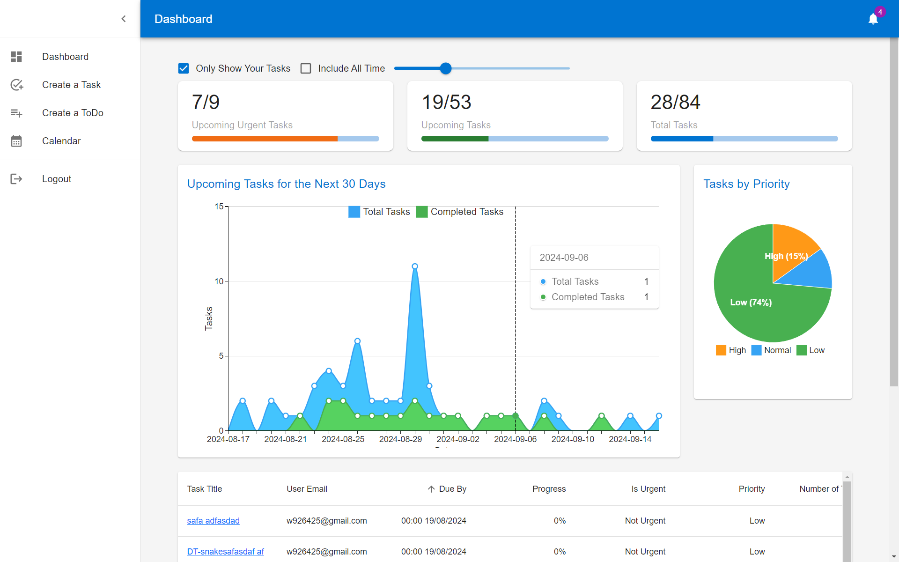
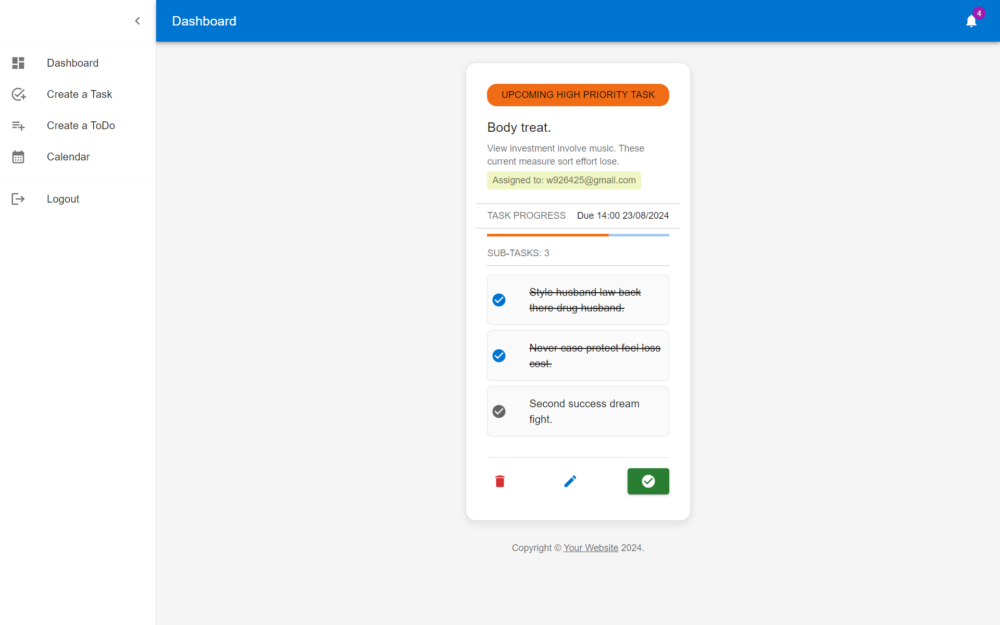
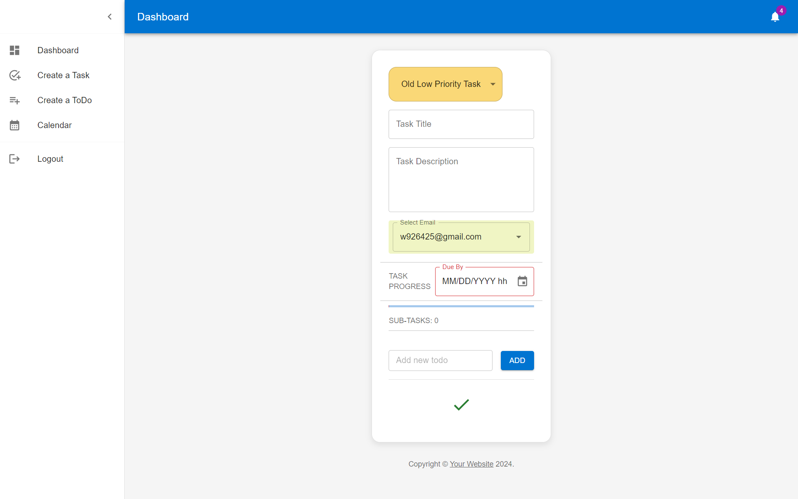

# Full Stack Development Setup Guide

This document provides a comprehensive guide for setting up and developing a full-stack application using React, Material UI for the frontend, and Django along with Django REST Framework for the backend.
## Table of Contents

- [Setup and Installation](#setup-and-installation)
  - [Python Virtual Environment](#python-virtual-environment)
  - [Install Python Dependencies](#install-python-dependencies)
  - [Django Project Initialization](#django-project-initialization)
  - [React.js and Yarn](#react-and-yarn)
- [Content](#content)
    - [Frontend Routes](#frontend-routes)
        - [Authentication](#authentication)
        - [Dashboard](#dashboard)
    - [Backend API Endpoints](#backend-api-endpoints)
        - [Tasks](#tasks)
        - [ToDos](#todos)
        - [Testing](#testing)
- [Development Resources](#development-resources)
    - [Frontend Development Resources](#frontend-development)
    - [Backend Development Resources](#backend-development)
- [Conclusion](#conclusion)
## Setup and Installation

### Python Virtual Environment

Create and activate a virtual environment to manage Python dependencies:

```bash
# Create virtual environment
python -m venv venv

# Activate virtual environment on Windows
venv\Scripts\Activate.ps1

# Deactivate virtual environment
deactivate
```
### Install Python Dependencies

```bash
# List installed packages
pip freeze

# Install Django
python -m pip install Django==4.2

# Install all required Python packages from a file
pip install -r requirements.txt

# Upgrade setuptools and pip
pip install --upgrade setuptools
python -m pip install --upgrade pip
```

### Django Project Initialization
```bash
# Start a new Django project
django-admin startproject backend .

# Create Django apps
python manage.py startapp core
python manage.py startapp userauths
python manage.py startapp api

# Run migrations and start the development server
python manage.py makemigrations
python manage.py migrate
python manage.py runserver

# Create a superuser for the Django admin
python manage.py createsuperuser
```

### React And Yarn
```bash
# Install Yarn globally
npm install --global yarn

# Create a new React project using Vite
yarn create vite . --template react

# Install dependencies and run the React development server
yarn
yarn dev
```
# Content

## Frontend Routes

### Authentication

- **/register/**: Register a new user account (Public Only)
- **/login/**: User login (Public Only)
- **/logout/**: User logout (Only Logged-in users)
- **/forgot-password/**: Password recovery feature (Public Only, restricted to registered emails due to [Mailgun API](https://www.mailgun.com/) limitations)
- **/create-new-password/**: Reset password interface (Public Only)


### Dashboard
 (Requires Login)

- **/user/dashboard/**: Central dashboard offering:
  - Line chart of upcoming tasks
  - Pie chart of tasks by priority
  - Counters for urgent tasks, upcoming tasks, and total tasks
  - A sortable table view of all tasks
   
- **/user/dashboard/task/:task_id/**: 
    - Detailed task view 
    - allowing for edits and adding todos
 
- **/user/dashboard/task-create/**: 
    - Interface to create new tasks with todos
 


## Backend API Endpoints
Please use the `http://localhost:8000/api/v1api/v1/` in a browser to see all options and arguments. 

### Tasks

- CRUD operations for tasks and additional endpoints for detailed task management, including email-based task creation and updates.

### ToDos

- Comprehensive ToDo management from creation to deletion, including viewing details and marking ToDos as completed.

### Testing

- Endpoints for generating random tasks and deleting all tasks to facilitate testing and development.
#### Create Random Tasks and ToDos
- **Endpoint**: `api/v1/test/random-create/`
- **Method**: POST
- **Description**: Generates random tasks with associated todos for each user. 


#### Delete All Tasks
- **Endpoint**: `api/v1/test/delete-all/`
- **Method**: DELETE
- **Description**: Deletes all tasks and associated todos from the database. 

#### Summary of Tasks
- **Endpoint**: `api/v1/test/summary/`
- **Method**: POST
- **Description**: Provides a summary of tasks, including a list of tasks per day, tasks sorted by priority, and counters for urgent tasks. This endpoint is used primarily to validate and ensure that the calculations made on the backend match expected outcomes and are consistent with frontend calculations.


# Development Resources

This document lists various resources for frontend and backend development, categorized by technology and purpose. These resources include tutorials, templates, and courses.

## Frontend Development

### React.js

- **React.js Tutorial**: Learn React.js basics and advanced concepts through this YouTube tutorial.
  [React.js YouTube Tutorial](https://www.youtube.com/watch?v=b9eMGE7QtTk)

### Material UI

- **Material UI Customization**: Master the customization of MUI components with this detailed Udemy course.
  [Mastering MUI Component Customization - Udemy](https://www.udemy.com/course/mastering-mui-component-customization/)

- **Table Design with MUI**: Learn how to design and implement tables using Material UI.
  [Material UI React Table](https://mui.com/material-ui/react-table/)

- **Chart Design with MUI**: Integrate various types of charts in your applications with Material UI.
  [Material UI Charts](https://mui.com/x/react-charts/)

- **MUI Templates**: Utilize pre-built templates for various views in Material UI to speed up development.
  [Material UI Templates](https://mui.com/material-ui/getting-started/templates/)

### Inspirational Designs

- **Task Card Design Inspiration**: Check out this card design on Dribbble for UI inspiration.
  [Task Cards on Dribbble](https://dribbble.com/shots/9055321-Task-Cards?utm_source=pinterest&utm_campaign=pinterest_shot&utm_content=Task+Cards&utm_medium=Social_Share)

## Backend Development

### Django

- **Django Official Documentation**: Start with the official Django documentation for version 4.2.
  [Django Documentation](https://docs.djangoproject.com/en/4.2/intro/)

- **Django with React Tutorial**: Learn how to integrate Django with React in this comprehensive Udemy course.
  [Learning Management System with Django and React - Udemy](https://www.udemy.com/course/learning-management-system-with-django-and-react/)

- **YouTube Django Tutorials**: Enhance your Django skills with these tutorial videos.
  - [Django YouTube Tutorial 1](https://www.youtube.com/watch?v=Rp5vd34d-z4)
  - [Django YouTube Tutorial 2](https://www.youtube.com/watch?v=Rp5vd34d-z4)

### Django REST Framework

- **REST Framework Tutorial**: Deep dive into Django REST Framework through this YouTube tutorial.
  [Django REST Framework Tutorial - YouTube](https://www.youtube.com/watch?v=c708Nf0cHrs)


